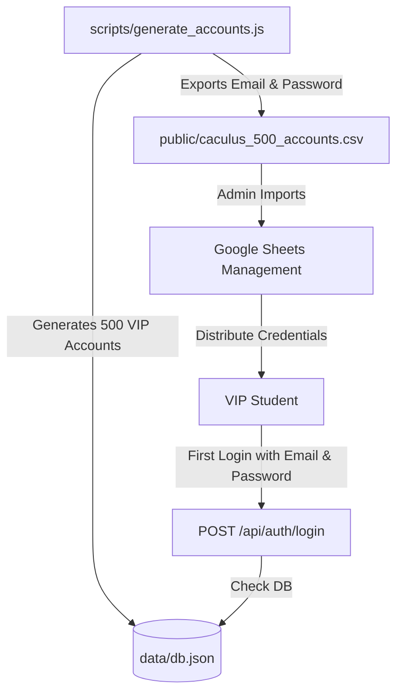
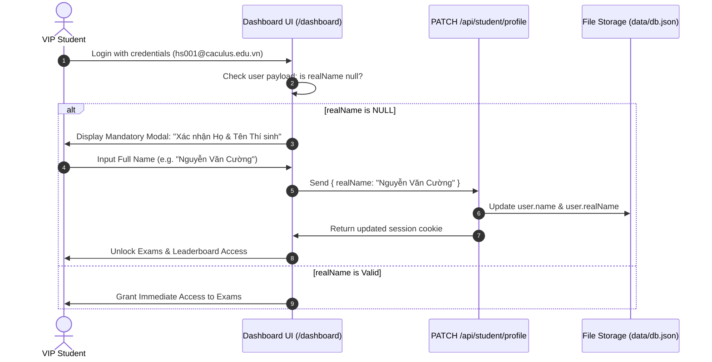
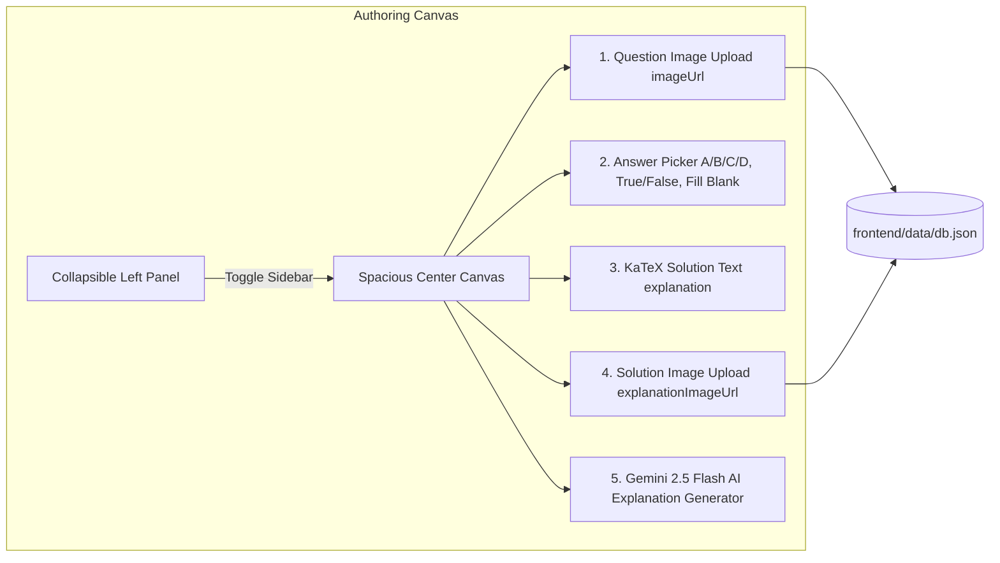

# CACULUS System Architecture & Technical Specification (Updated August 2026)

This document serves as the authoritative architectural blueprint for the **CACULUS TSA Examination Platform**. It defines system component layouts, the pre-provisioned 500 VIP student account pool, the mandatory first-login Name Entry flow, session security models, image-based question authoring workspace, explanation image uploads, and client/server boundary rules.

---

## 1. Directory & System Component Overview

The application is structured as a modern Next.js 16+ App Router web platform backed by structured, persistent local JSON storage (`data/db.json`).

```
caculus/
├── public/                       # Static public assets
│   ├── logo-caculus.png          # High-resolution platform brand logo
│   └── caculus_500_accounts.csv  # Exported CSV of 500 VIP student credentials for Google Sheets
│
├── frontend/                     # Next.js App Router Monorepo Core
│   ├── app/                      # Next.js App Router (Pages, Layouts & Route Handlers)
│   │   ├── admin/                # Admin Portal
│   │   │   ├── page.tsx          # Admin control panel & monitoring stats
│   │   │   ├── exams/
│   │   │   │   ├── page.tsx      # Consolidated Exam Management (Publish toggles, Edit modal)
│   │   │   │   └── editor/
│   │   │   │       └── page.tsx  # Full Authoring Workspace (Image-based prompts, KaTeX, Solution images)
│   │   ├── dashboard/            # Student Portal (Horizontal list view, Collapsible category accordions)
│   │   ├── exams/                # Examination Environment & Real-time testing room
│   │   │   └── [examId]/room/    # Split-screen exam room with timer & anti-cheat monitoring
│   │   ├── leaderboard/          # Rankings (Displays only students with verified realName)
│   │   ├── login/                # High-aesthetic Login Form (Autofill protected)
│   │   ├── api/                  # Server-side API Route Handlers
│   │   │   ├── admin/            # Admin endpoints (/exams, /exams/[id]/toggle, /generate-explanation, /monitoring)
│   │   │   ├── auth/             # Session endpoints (/login, /logout, /me, /[...nextauth])
│   │   │   └── student/          # Student endpoints (/exams, /profile, /leaderboard, /submit)
│   │   ├── layout.tsx            # Global Root Layout & Be Vietnam Pro font configurations
│   │   └── globals.css           # Crimson Red design system tokens (#d90429) & micro-animations
│   │
│   ├── components/               # Reusable React Components (Client & Server)
│   │   ├── layout/
│   │   │   └── Navbar.tsx        # Crimson Red header banner (#d90429) & user profile badge
│   │   ├── test-room/
│   │   │   └── SplitTestRoom.tsx # Real-time split-screen examination & draft preview engine
│   │   ├── ui/
│   │   │   └── MathText.tsx      # KaTeX inline ($...$) & block ($$...$$) math renderer
│   │   └── AntiCheatMonitor.tsx  # Tab switch & fullscreen exit detector
│   │
│   ├── data/                     # Persistent local storage
│   │   └── db.json               # Physical CSDL file containing 502 accounts & 44 seeded exams
│   │
│   ├── lib/                      # Business logic & Server adapters (@/lib)
│   │   ├── auth.ts               # Jose JWT signing/verification & bcrypt password hashing
│   │   ├── db.ts                 # File system data provider (fs read/write wrapper)
│   │   └── mockData.ts           # Pre-seeded 44 TSA exams (3 DEMO + 21 Practice + 20 VIP Full)
│   │
│   ├── scripts/                  # Standalone administrative scripts
│   │   ├── generate_accounts.js  # Script generating 500 VIP accounts & exporting CSV
│   │   └── preseed_db.js         # Script seeding database with 44 exams & questions
│   │
│   ├── types/                    # Domain models & TypeScript interfaces
│   │   └── index.ts              # Schemas for User (realName), Question (imageUrl, explanationImageUrl), Exam
│   │
│   ├── middleware.ts             # Route protection & session proxy middleware
│   ├── auth.ts                   # NextAuth (Auth.js v5) configuration file
│   └── package.json              # Next.js 16+, jose, bcryptjs, next-auth, lucide-react
│
└── ARCHITECTURE.md               # Technical specification document (this file)
```

---

## 2. Pre-provisioned 500 VIP Account Pool & Data Flow

CACULUS operates as a closed, high-capacity examination platform using a pre-provisioned pool of **500 VIP Student Accounts**:



### Account Specifications
- **Super Admins**:
  - `admin@caculus.edu.vn` (Pass: `admin123`) - Role: `admin`
  - `admin2@caculus.edu.vn` (Pass: `admin123`) - Role: `admin`
- **VIP Students**:
  - `hs001@caculus.edu.vn` through `hs500@caculus.edu.vn`
  - Random 6-character alphanumeric passwords (e.g. `x7k9p2`)
  - Default attributes: `role: "student"`, `isVip: true`, `realName: null`

---

## 3. Mandatory "Name Entry" Flow on First Login

To prevent proxy test taking while avoiding manual account creation overhead:



### Leaderboard Visibility Rule
- Only accounts with a non-null, verified `realName` are included in the Leaderboard rankings (`GET /api/student/leaderboard`). Anonymous accounts (`realName: null`) are automatically filtered out.

---

## 4. Image-Based Question Authoring & Explanation Architecture

The Full Authoring Workspace (`/admin/exams/editor`) provides an optimized canvas layout:



### Key Capabilities & Data Schemas
1. **Question Prompt Image (`imageUrl`)**:
   - Questions are centered around image prompts where text, diagrams, and options are embedded directly inside the image file.
2. **Options Picker**:
   - Single Choice: 1 correct option (A/B/C/D).
   - Multiple Choice: True/False toggle for individual statements (a, b, c, d).
   - Fill-in-the-blank: Comma-separated acceptable exact match values.
3. **Explanation & Solution Image (`explanationImageUrl`)**:
   - Step-by-step KaTeX math explanation text + solution diagram / handwritten answer image.
   - **`Gemini 2.5 Flash API`** (`POST /api/admin/generate-explanation`): Instant AI solution generator on demand.
4. **Question Groups (Contexts / Bối cảnh)**:
   - Group context title, passage text/notes, group diagram image upload (`imageUrl`), child questions list, and **`[+ Thêm câu hỏi thuộc bối cảnh này]`** action button.

---

## 5. Security & Cookie Session Architecture

1. **Authentication Token (`jose`)**:
   - JWT signed with `HS256` secret key storing payload: `{ userId, email, role, name, realName, studentId, isVip }`.
   - Expires in **7 days**.
2. **HttpOnly Cookie Standard**:
   - `caculus_token`: Signed JWT token string (`HttpOnly`, `SameSite=Lax`, `Path=/`).
   - `caculus_session`: Serialized user session JSON (`HttpOnly`, `SameSite=Lax`, `Path=/`).
3. **Autofill & Security Hardening**:
   - Login inputs use `autoComplete="new-password"` and obscure field names to defeat browser autofill glitches.

---

## 6. Exam Category Color Theme & Navigation Matrix

Exams are organized into 4 distinct color-coded sections on the student dashboard:

| Category Code | Section Name | Color Theme | Tailwind CSS Badge |
| :--- | :--- | :--- | :--- |
| `LUYỆN TẬP - math` | LUYỆN TOÁN | 🔵 Ocean Blue | `bg-blue-100 text-blue-700 border-blue-200` |
| `LUYỆN TẬP - reading` | LUYỆN ĐỌC HIỂU | 🟣 Royal Purple | `bg-purple-100 text-purple-700 border-purple-200` |
| `LUYỆN TẬP - science` | LUYỆN KHOA HỌC | 🟢 Emerald Green | `bg-emerald-100 text-emerald-700 border-emerald-200` |
| `THỰC CHIẾN` | THỰC CHIẾN (FULL 3 PHẦN) | 🔥 Crimson Red | `bg-[#d90429] text-white font-extrabold` |

---

## 7. Client vs. Server Execution Boundaries

| Boundary Rule | Server Environment (Node.js) | Client Environment (Browser Runtime) |
| :--- | :--- | :--- |
| **Directives** | API Route Handlers (`app/api/**`), `@/lib/db`, `@/lib/auth` | Components marked with `'use client'` |
| **File System (`fs`)** | Allowed (`fs.readFileSync`, `fs.writeFileSync`) | **FORBIDDEN** |
| **Session Control** | Cookie setting & JWT signature | `localStorage` fallback + React State |

---

## 8. Build Integrity & Verification

- **Production Build Command**: `npm run build`
- **Route Count**: 28/28 Static & Dynamic Routes prerendered cleanly.
